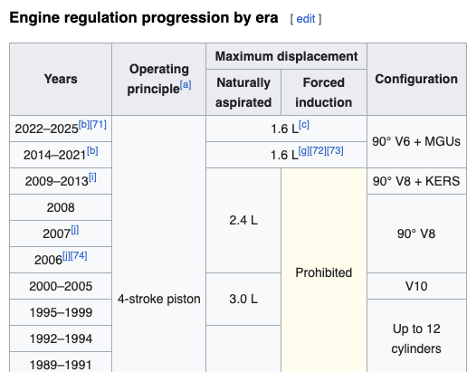

```{r setup, include = FALSE}
knitr::opts_knit$set(root.dir = '/Users/santigtz/Desktop/SMU_D.S./Semester_2/6372-AppliedStatistics/Project_1/F1ParametricModeling')

# knitr::opts_knit$set(root.dir = 'C:/SMU MS Data Science/AppliedStatistics6372/Project1/F1ParametricModeling')
```

```{css, echo=FALSE}
@font-face {
  font-family: F1;
  src: url(https://www.formula1.com/etc/designs/fom-website/fonts/F1Regular/Formula1-Regular.ttf);
}

span{
  font-family: F1;
}

a{
  font-family: F1;
}

.nav-pills>li.active>a:focus {
    color: #ffffff;
    background-color: lightgray;
}

.container-fluid, .container-fluid h1 {
    font-family: F1;
    line-height: 1.7;
}

.container-fluid p {
    font-family: F1;
    color:black;
}

h1,h2,h3,h4,h5,h6,p, 
  color: black
}
```

<br>

# - Introduction
<hr>
<div style="width: 100%;">

  <div style="background-color: #00D2BE;width:9px;height:792px;float: left;"></div>
  
  
  <div style="float:left; margin-left:0px; margin-top:15px; font-size:20px; color:black;">
  </div>
In this analysis, we will analyze Formula 1 data from the year 2,000 and onward. The reason for this time frame is because of two things: the first begin that there no active drivers that began their F1 careers before the year 2,000, and the second being that, beginning in the year 2,000, it was mandated that all racecars have the same engine size, which would change overtime.
   

<br>
<br>


Furthermore, our analysis dives into the relationship between a driver's starting position and the likelihood of obtaining a certain finishing result. One would assume that the better one qualifies, the higher the change of winning the race. Also, it is known that there are a few big teams/drivers who have dominated the sport over the years and continue to do so, thus providing relatively consistent results. One can easily assume that certain teams are much more likely to win a Grand Prix thus those teams are more statistically significant in determining the result of a race. Because of this, we also investigate the relationship between the results/points given the constructors (teams) and drivers.

Lastly, we create several prediction models that allow for predicting a race results. We use ONLY the parameters that one would have available just before a race: the team name, the driver name, the era (engine size) and the starting position.
  
<br>

# - Packages
<hr>
```{r message=FALSE, warning=FALSE}
knitr::opts_chunk$set(echo = TRUE)

library(dplyr)
library(ggplot2)
library(caret)
library(class)
```

<br>


# - EDA
<hr>
**Starting Position Vs Race Result**
<br>
Unfortunately, due to lack of programming knowledge, we were unable to create the plot that we wanted. However, we found exactly what we needed online and thus decided to include that plot with the source tagged just below it.

From the plot, one can see that there does in-fact appear to be a relationship between a driver's starting position. It is clear that the higher one starts on the grid, the higher the probability of winning the race. In addition these findings, we also noted that the lower one starts on the grid, the higher the probability of not finishing the race (DFN), which could make sense if one assumes that drivers towards the back are driving much less conservatively and thus more aggressive than those towards the front.


Source: MrBookman_LibraryCop"(Reddit User)
<br>
[Click Here to Visit Source](https://www.reddit.com/r/dataisbeautiful/comments/rgt8wz/oc_formula_1_probability_of_grand_prix_result_by/)

<br>
**Constructor/Driver Vs Race Result**
<br>


<br>


# - Modeling Data
<hr>
**The data includes all race results since the year 2,000 and the following attributes:**
<ul>
  <li>Drive name/id   // currently only the 25 drivers with the most race results have a unique name. All other drivers have there names labeled 'Other'.</li>
  <li>Constructor name/id   // currently only the 25 constructors with the most reace results have a unique name. All other constructors have there names labeled 'Other'.</li>
  <li>Race name/id.</li>
  <li>Starting position labeled 'grid'.</li>
  <li>Finishing position labeled 'positionOrder'.</li>
  <li>The altitude of a track.</li>
  <li>The era of engine size.</li>
</ul>

```{r}
F1DataFrame = read.csv("ModelingData/F1ModelingCustomCategoricalVariables.csv")

head(F1DataFrame)
```

<br>

**Logic to split data into training and testing sets.**
```{r}
modelVariables = c('positionOrder', 'grid', 'name', 'fullname', 'era')
modelDataframe = F1DataFrame[, modelVariables]

set.seed(4)

trainingIndices = sample(c(1:dim(modelDataframe)[1]), dim(modelDataframe)[1]*0.8)

trainingDataframe = modelDataframe[trainingIndices,]
testingDataframe = modelDataframe[-trainingIndices,]
```


<br>

# - Model 1 (Liner Regression)
<hr>
**The Model**
<br>
mymodel<-lm(positionOrder ~ grid + name + fullname + era, data = F1DataFrame)
<br>

**Residuals Vs Fitted Plot**
<ul>
  <li>Shows evidence of a negative slope with variance that seems to increase as fitted values increase.</li> 
  <li>This means the model is on average predicting worse results for drivers who finish with a good results.</li>
  <li>As the fitted values increase it seems to get a wider difference in predicted vs actual results.</li>
</ul>

**Q-Q Plot**
<ul>
  <li>Suggests a normal distribution can be assumed</li>
</ul>

**Scale-Location Plot**
<ul>
  <li>Provides more evidence for normality.</li>
  <li>There seems to be a patterns in starting at each discrete fitted value and traveling parallel to the Y axis with a sin function but with sharp 90 degree transitions.</li>
  <li>Currently we don't have an explanation for why this is.</li>
</ul>

```{r}
mymodel<-lm(positionOrder ~ grid + name + fullname + era, data = F1DataFrame)
par(mfrow = c(1,1))
plot(mymodel)
```

<br>

**Model Summary Statistics**

<ul>
  <li>The model doesn't not perform well With R-squared values at 0.27.</li>
  <li>Surprisingly starting position doesn't appear to be statistically significant which doesn't make sense. One would expect there to be a strong correlation between starting position and finishing position.</li>
</ul>

```{r}
summary(mymodel)
```

<br>

**Investigation**
<ul>
  <li>The grouping of low starting positions and high finishing positions during the era of up to 12 cylinders explains the irregularities from normality in the models residual plots and lack of statistical significance in the model for stating position.</li>
</ul>

```{r}
mymodel<-lm(positionOrder ~ grid, data = F1DataFrame)

ggplot(data = F1DataFrame, aes(x = grid, y = positionOrder, colour = era)) + 
  geom_point(position = "jitter", size = .8) +
  labs(title="starting vs finishing position by era", 
     y="finishing position", 
     x="starting position")
```

<br>
<br>

<ul>
  <li>Plots look similar to the full model as expected.</li>
</ul>
```{r}
mymodel<-lm(positionOrder ~ grid, data = F1DataFrame)
par(mfrow = c(1,1))
plot(mymodel)
```


<br>

# - Model 2 (Liner Regression)
<hr>

<ul>
  <li>The residual plots look similar to the first model.</li>
</ul>
```{r}
mymodel<-lm(positionOrder ~ grid + name + fullname + era + grid:era, data = F1DataFrame)
par(mfrow = c(1,1))
plot(mymodel)
```

<br>

**Model 2 Summary Statistics**
<ul>
  <li>The model performs significantly better With R-squared values going from 0.27 to 0.32.</li>
</ul>
```{r}
summary(mymodel)
```


<br>

# - Model 3 (Liner Regression)
<hr>
<ul>
  <li>Taking out the data from the 12 cylinders era further improves the R-squared values to 0.39
  <li>Now starting position appears to be statistically significant which matches our intuition.</li>
  <li>This model appears to be the best and provides the highest R-squared of all the models, but not the least amount of error.</li>
</ul>
```{r}
F1DataFrame = F1DataFrame %>% filter(F1DataFrame$year >= "2000")
mymodel = lm(positionOrder ~ grid + name + fullname + era + grid:era, data = F1DataFrame)
simpleModel = lm(positionOrder ~ grid, data = F1DataFrame)
par(mfrow = c(1,1))
plot(mymodel)
```

<br>

**Model 3 Summary Statistics**
```{r}
summary(mymodel)
```
```{r}
summary(simpleModel)
```


<br>

# Plots for Each Era
<hr>
</ul>
  <li>Seems to show a weak but significant correlation between better starting positions with better finishing positions.</li>
  <li>All plots appear to have comparable distributions.</li>
</ul>
```{r}
V10plot = F1DataFrame %>% filter(F1DataFrame$era == "V10") %>% ggplot(aes(x = grid, y = positionOrder, colour = era)) + 
  geom_point(position = "jitter", size = .8) +
  labs(title="starting vs finishing position by era", 
     y="finishing position", 
     x="starting position")

V8plot = F1DataFrame %>% filter(F1DataFrame$era == "90 degrees V8") %>% ggplot(aes(x = grid, y = positionOrder, colour = era)) + 
  geom_point(position = "jitter", size = .8) +
  labs(title="starting vs finishing position by era", 
     y="finishing position", 
     x="starting position")

V8MGUsplot = F1DataFrame %>% filter(F1DataFrame$era == "90 degrees V6 + MGUs") %>% ggplot(aes(x = grid, y = positionOrder, colour = era)) + 
  geom_point(position = "jitter", size = .8) +
  labs(title="starting vs finishing position by era", 
     y="finishing position", 
     x="starting position")

V10plot
V8plot
V8MGUsplot
```


<br>

# - Model 4 (KNN)
<hr>
<ul>
  <li>This model also performed well relative to the first two. It also provides the least amount of error, so we chose this as the best model - regardless of Model 3 having a higher R-squared.
</ul>
```{r}
set.seed(1234)
fitControl<-trainControl(method="repeatedcv",number=10,repeats=1)
knn.fit<-train(positionOrder~.,
               data=modelDataframe,
               method="knn",
               trControl=fitControl,
               tuneGrid=expand.grid(k=c(1:10,20,30))
               )
knn.fit
```

<br>
# THANK YOU!